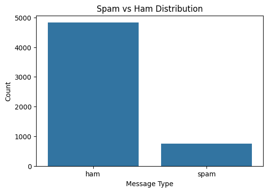
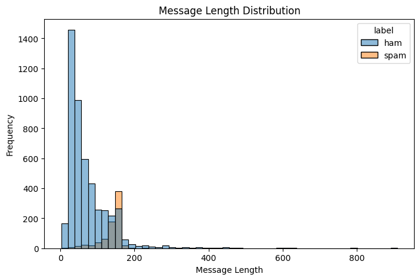
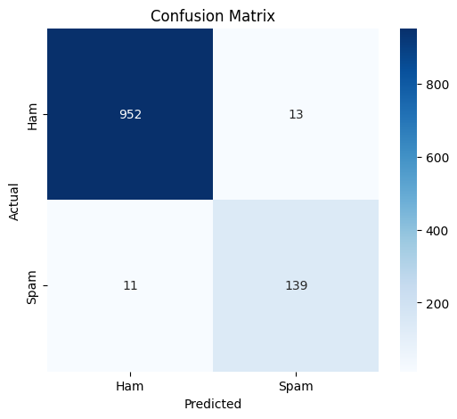

# Implementation of Naïve Bayes - Group 2

| NRP | Name |
|:---:|:----:|
| 5025241015 | Farrel Aqilla Novianto |
| 5025241153 | Kamal Zaky Adinata |
| 5025241181 | Muhammad Naufal Hadaya Setiawan |
| 5025241212 | Akmal Yusuf |

## Table of Contents

- [Bayes' Theorem Overview](#1-bayes-theorem-overview)
- [Application of Bayes' Theorem in the Naïve Bayes Algorithm](#2-application-of-bayes-theorem-in-the-naïve-bayes-algorithm)
- [Dataset Description](#3-dataset-description)
- [Naïve Bayes Implementation Results](#4-naïve-bayes-implementation-results)
- [Conclusion](#5-conclusion)

## 1. Bayes' Theorem Overview
Bayes' Theorem is a fundamental mathematical formula used in probability and statistics. At its core, it provides a way to **update our beliefs or probabilities based on new evidence**.

Instead of just looking at the probability of an event happening in isolation, Bayes' Theorem helps us calculate the probability of an event happening given that another related event has already occurred.

### The Formula
The theorem is expressed mathematically with the following equation:

$$P(A|B) = \frac{P(B|A) \cdot P(A)}{P(B)}$$

To understand the formula, we need to break down what each piece represents. Let's assume $A$ is a hypothesis and $B$ is the observed evidence:
- $P(A|B)$ **(Posterior Probability)**: The probability of event $A$ being true, given that the evidence $B$ is present. This is usually the answer we are trying to find.
- $P(B|A)$ **(Likelihood)**: The probability of observing evidence $B$, given that hypothesis $A$ is true.
- $P(A)$ **(Prior Probability)**: Our initial belief in the probability of event $A$ occurring, before we saw any new evidence.
- $P(B)$ **(Marginal Probability)**: The total probability of observing the evidence $B$ under all possible scenarios (whether $A$ is true or not).

### A Classic Example: The Medical Test

The best way to grasp Bayes' Theorem is through the classic "rare disease" scenario.

Imagine a rare disease that affects **1%** of the population. A medical test for this disease is **99% accurate** (it correctly identifies 99% of sick people as positive, and 99% of healthy people as negative).

If a randomly selected person tests positive, what is the actual probability that they have the disease?

Human intuition often jumps straight to "99%." However, Bayes' Theorem reveals a very different reality. Let's plug in the numbers:
- $A$: The patient has the disease. Therefore, $P(A) = 0.01$ (Prior).
- $B$: The test result is positive.
- $P(B|A)$: The test is positive given the patient is sick = $0.99$ (Likelihood).
- $P(B)$: The total probability of getting a positive test. This happens if a sick person tests positive ($0.01 \cdot 0.99$) PLUS if a healthy person gets a false positive ($0.99 \cdot 0.01$). So, $P(B) = 0.0099 + 0.0099 = 0.0198$.

Now, we use the formula:

$$P(A|B) = \frac{0.99 \cdot 0.01}{0.0198} = 0.5$$

**The Result:** Even with a 99% accurate test, because the disease itself is so rare, a person with a positive result only has a **50%** chance of actually having the disease. The "prior" (the rarity of the disease) heavily anchors the final probability.

## 2. Application of Bayes' Theorem in the Naïve Bayes Algorithm

The Naïve Bayes algorithm is a highly popular machine learning technique used primarily for classification tasks, such as spam detection, sentiment analysis, and categorizing news articles. It is a direct, practical application of Bayes' Theorem, but with one massive, simplifying assumption.

### The "Naïve" Assumption: Conditional Independence

In the real world, data points (features) are often correlated. For example, in an email, the word "Free" and the word "Money" frequently appear together.

The Naïve Bayes algorithm ignores this reality. It makes the **"naïve" assumption that every single feature is completely independent of every other feature**, given the class label.

While this assumption is almost never entirely true in practice, it simplifies the mathematical calculations enormously and, surprisingly, still results in highly accurate and incredibly fast classifications.

### The Math: From One Event to Many Features

Let's look at how Bayes' Theorem adapts to handle a machine learning dataset. Suppose we have a data point with multiple features $X = (x_1, x_2, \dots, x_n)$ and we want to predict its class $y$ (e.g., Spam or Not Spam).

Standard Bayes' Theorem looks like this:

$$P(y | x_1, x_2, \dots, x_n) = \frac{P(x_1, x_2, \dots, x_n | y) \cdot P(y)}{P(x_1, x_2, \dots, x_n)}$$

Calculating the exact likelihood of that specific combination of features—$P(x_1, x_2, \dots, x_n | y)$—is computationally impossible for large datasets. This is where the naïve assumption comes to the rescue. Because we assume the features are independent, we can simply multiply their individual probabilities together:

$$P(x_1, x_2, \dots, x_n | y) = P(x_1|y) \cdot P(x_2|y) \cdot \dots \cdot P(x_n|y) = \prod_{i=1}^{n} P(x_i | y)$$

When we substitute this back into Bayes' Theorem, the formula becomes much easier for a computer to process:

$$P(y | x_1, \dots, x_n) = \frac{P(y) \prod_{i=1}^{n} P(x_i | y)}{P(x_1, \dots, x_n)}$$

### The Classification Rule

When a Naïve Bayes model is trying to classify a new piece of data, it doesn't actually need to calculate the exact probability. It just needs to figure out which class has the highest probability.

Since the denominator $P(x_1, \dots, x_n)$ is the exact same for every class you are comparing, the algorithm simply drops it. The model calculates the proportional probability for each possible class $y$ and chooses the maximum value:

$$\hat{y} = \arg\max_y \left( P(y) \prod_{i=1}^{n} P(x_i | y) \right)$$

### Example: Student Major Classification

Let's say we look at a student's short bio containing just two words: "C++" and "Data". We want to classify it as $y=\text{Informatics}$ or $y=\text{Industrial}$.

1. **Calculate the Priors** $P(y)$: Based on the student population data on campus, let's say 20% are Informatics Engineering students ($0.20$) and 80% are Industrial Engineering students ($0.80$).

2. **Calculate the Likelihoods** $P(x_i|y)$: We look at our training data to find how often these words appear in the bios for each major.
   - Probability of "C++" given they are Informatics: $P(\text{C++}|\text{Informatics}) = 0.70$
   - Probability of "Data" given they are Informatics: $P(\text{Data}|\text{Informatics}) = 0.50$
   - Probability of "C++" given they are Industrial: $P(\text{C++}|\text{Industrial}) = 0.05$
   - Probability of "Data" given they are Industrial: $P(\text{Data}|\text{Industrial}) = 0.40$

3. **Apply the Formula:**
   - **Informatics Score:** $0.20 \cdot 0.70 \cdot 0.50 = 0.07$
   - **Industrial Score:** $0.80 \cdot 0.05 \cdot 0.40 = 0.016$

Because $0.07$ is significantly larger than $0.016$, the algorithm confidently classifies the student as an **Informatics Engineering** student.

## 3. Dataset Description
SMS Spam Collection Dataset is a collection of messages that have been labeled manually for  mobile spam research.

A. Data Structure
This dataset consist of 5.572 row of data with column like this :
   - v1 (Target) : Label clasification of the messages that separate of 2 categories :
        - 'ham'  : normal messages.
        - 'spam' : scam, spam, and promotion messages.
   - v2 (feature) : raw text form the messages that will be analyze
   - unnamed column : there are 3 unnamed columns that will be ignored during data processing.

B. Data Statictics
The dataset is imbalanced, which is typical for spam detection tasks:
   - Total Messages: 5,572
   - Ham (Legitimate): 4,825 (86.6%)
   - Spam: 747 (13.4%)
     

## 4. Naïve Bayes Implementation Results

### Implementation Process

The implementation of the Naïve Bayes classifier in this project follows several structured steps, starting from text preprocessing to probabilistic classification. The goal is to transform raw SMS messages into a numerical representation that allows probabilistic computation using Bayes' Theorem.

#### 1. Text Vectorization

Since machine learning algorithms cannot directly process raw text data, the SMS messages must first be converted into a numerical representation. In this project, the **Bag-of-Words (BoW)** technique is used to perform this transformation.

The Bag-of-Words model creates a vocabulary containing all unique words in the dataset. Each SMS message is then represented as a vector that indicates how many times each word appears in that message. As a result, each message becomes a numerical feature vector that can be processed by the classification algorithm.

This step is important because it converts unstructured text data into structured numerical data while preserving useful information about word frequency.

#### 2. Prior Probability Calculation

After the text data has been transformed into vectors, the next step is to calculate the **prior probability** for each class.

The prior probability represents the likelihood of a class occurring in the dataset before considering any specific message content. It is calculated using the proportion of each class in the training dataset.

For this spam classification problem, the prior probabilities are:

- **P(Spam)** – the probability that a randomly selected message is spam  
- **P(Ham)** – the probability that a randomly selected message is a legitimate (non-spam) message  

These probabilities provide the baseline assumption about the dataset distribution before any word information is considered.

#### 3. Likelihood Calculation

The next step is to calculate the **likelihood probabilities**, which represent the probability of a specific word appearing given a particular class.

For each word in the vocabulary, the algorithm calculates:

- **P(word | spam)** – probability of the word appearing in spam messages  
- **P(word | ham)** – probability of the word appearing in ham messages  

These probabilities are estimated from the training dataset by counting how frequently each word appears in messages belonging to each class.

To prevent the problem of **zero probability**, the algorithm applies **Laplace smoothing**. This technique ensures that words that do not appear in a specific class during training still receive a small probability value. Without smoothing, the presence of an unseen word could cause the entire probability calculation to become zero.

#### 4. Posterior Probability Calculation

Once the prior and likelihood probabilities are computed, the classifier calculates the **posterior probability** for each class using Bayes' Theorem.

For a given message containing several words, the Naïve Bayes classifier estimates:

P(Class | Message) ∝ P(Class) × Π P(word | Class)

This formula means that the probability of a message belonging to a certain class depends on:

- the prior probability of the class
- the likelihood of observing each word given that class

The "naïve" assumption of the algorithm is that all features (words) are **conditionally independent** given the class label. Although this assumption is rarely perfectly true in real-world data, it greatly simplifies the computation and often produces surprisingly good results in practice.

Finally, the classifier assigns the message to the class with the **highest posterior probability**.

---

### Model Performance

After the model was trained using the training dataset, it was evaluated using a separate testing dataset. The goal of this evaluation step is to measure how accurately the model can classify unseen messages.

Several evaluation metrics were used to assess the classifier's performance:

- **Accuracy** – measures the overall proportion of correctly classified messages  
- **Precision** – measures the reliability of spam predictions  
- **Recall** – measures how effectively the model detects spam messages
- **F1-Score** - measures the balance between precision and recall, indicating how well the model handles both false positives and false negatives

These metrics provide a more complete understanding of the model’s performance than accuracy alone.

**Example output obtained from the experiment:**

- **Accuracy:** 97.85%  
- **Precision:** 91.45%  
- **Recall:** 92.67%
- **F1-Score:** 92.05%

The high accuracy indicates that the classifier correctly identifies the majority of messages. High precision suggests that most messages predicted as spam are actually spam, while high recall shows that the model is able to detect a large portion of the true spam messages. Finally, the high F1-score summarizes the overall balance between precision and recall in the classifier’s performance.

---

### Dataset Distribution Visualization

Understanding the dataset distribution is important before applying a classification algorithm. The following visualization illustrates the number of spam and ham messages in the dataset.

From this visualization, we can observe that the dataset contains significantly more **ham messages than spam messages**, which is a common characteristic of real-world messaging datasets. This imbalance can influence the classification process and must be considered when evaluating the model.

---

### Message Length Distribution

Another useful analysis is the distribution of message lengths for both classes.

This visualization shows that spam messages often tend to be longer than regular messages because they frequently contain promotional content, links, or advertising text. Meanwhile, ham messages are typically shorter and more conversational.

Analyzing message length helps us better understand the characteristics of the dataset and provides additional insight into the differences between spam and legitimate messages.

---

### Confusion Matrix

To further evaluate the classification performance, a **confusion matrix** is used.

The confusion matrix compares the predicted labels generated by the model with the actual labels in the dataset.

- **True Positive (TP):** spam messages correctly classified as spam  
- **True Negative (TN):** ham messages correctly classified as ham  
- **False Positive (FP):** ham messages incorrectly classified as spam  
- **False Negative (FN):** spam messages incorrectly classified as ham  

By examining the confusion matrix, we can observe how well the classifier distinguishes between spam and ham messages. Ideally, the values for **TP and TN should be high**, while the values for **FP and FN should be as low as possible**.

## 5. Conclusion

This project demonstrates the practical implementation of the **Naïve Bayes algorithm** for SMS spam classification. The classifier was built by applying Bayes' Theorem and computing prior probabilities, likelihood probabilities, and posterior probabilities directly from the dataset.

The experiment shows that Naïve Bayes is highly effective for text classification tasks, particularly in spam detection. Despite the simplifying assumption that features are conditionally independent, the algorithm performs well because it captures the statistical patterns of word usage within each class.

In conclusion, the Naïve Bayes classifier remains one of the most efficient and widely used algorithms in natural language processing and machine learning. Its simplicity, computational efficiency, and strong performance make it a valuable approach for classification tasks such as spam filtering, document categorization, and sentiment analysis.
